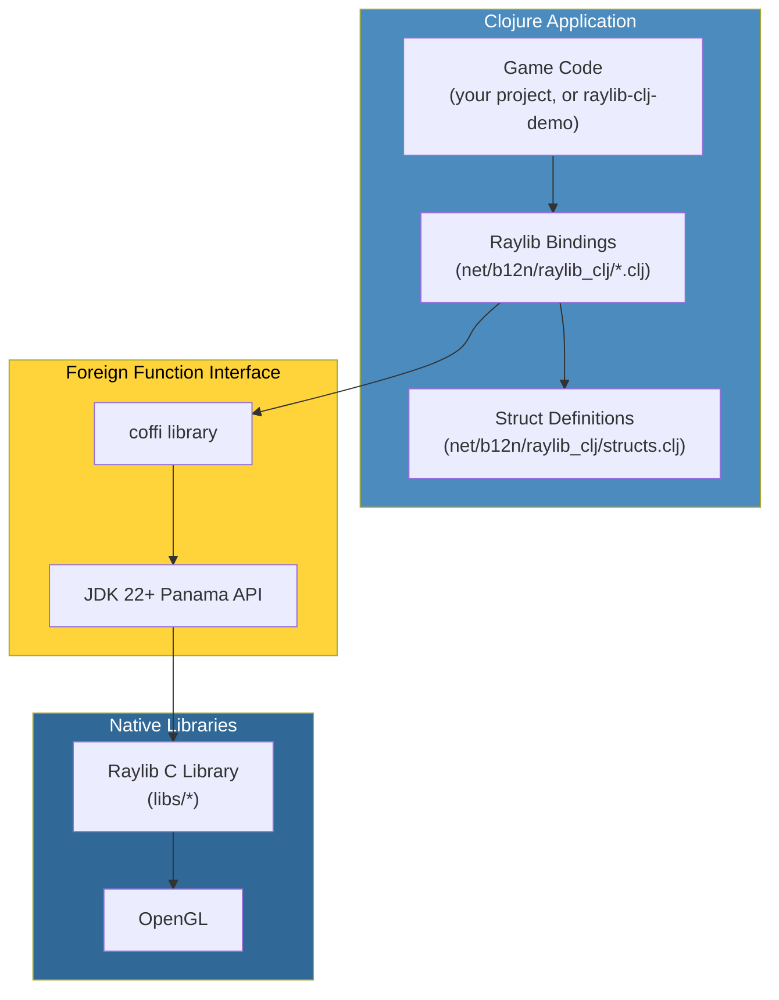
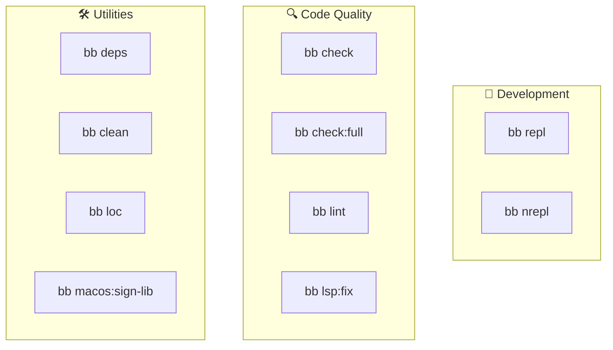

# raylib-clj

Clojure bindings for [raylib](https://www.raylib.com/). They call raylib's C library directly through
[coffi](https://github.com/IGJoshua/coffi) over JDK 22+'s Foreign Function &
Memory API (Project Panama): no wrapper library, no codegen.

The 113 example programs that used to live here, with their GIFs and assets,
moved to [raylib-clj-demo](https://github.com/b12n-oss/raylib-clj-demo), one
project per example. This repo is the library only.

This project began as
[ertugrulcetin/raylib-clojure-playground](https://github.com/ertugrulcetin/raylib-clojure-playground)
and still carries its history; the FFI binding layer is largely his. See
[NOTICE](NOTICE) for the full attribution.

## Architecture Overview



## What You Need

- **JDK 22 or newer** (required for the Foreign Function API)
- **Clojure CLI** (recommended) or Leiningen
- **Babashka** (optional, for task automation)

## Getting Started

The library has no window of its own, so there is nothing to run from this
repo. To see it work, clone
[raylib-clj-demo](https://github.com/b12n-oss/raylib-clj-demo) and run any of
its scenes. To check your checkout instead:

```bash
bb check             # Compile every namespace under src/, then lint
bb nrepl             # Standalone nREPL on port 7999, for non-GUI work
```

Use `clojure`, not `clj`, when you run a GUI app; `clj` adds `rlwrap`, which
interferes with the event loop. See
[getting-started.md](docs/guide/getting-started.md) for the full install
walkthrough.

## Babashka Tasks

This project includes Babashka tasks for the development workflow:



### 🔧 Development

| Command | Description |
|---------|-------------|
| `bb repl` | Start Clojure REPL for interactive development |
| `bb nrepl` | Start nREPL server on port 7999 (for non-GUI work) |

> **For live game development:** run a game from [raylib-clj-demo](https://github.com/b12n-oss/raylib-clj-demo), then connect your editor to port **7888**.

### 🔍 Code Quality

| Command | Description |
|---------|-------------|
| `bb check` | ⭐ Fast checks: compiles every namespace under `src/`, then runs clj-kondo. The pre-commit gate. |
| `bb check:full` | Comprehensive checks (compile + lint + LSP) |
| `bb lint` | Run clj-kondo linter |
| `bb lsp:format` | Format all Clojure files |
| `bb lsp:clean-ns` | Clean and organize namespace forms |
| `bb lsp:fix` | Auto-fix formatting + namespace issues |
| `bb lsp:check` | Run all LSP checks (dry run) |

### 📦 Dependencies

| Command | Description |
|---------|-------------|
| `bb deps` | Download and cache all dependencies |
| `bb deps:tree` | Show dependency tree |
| `bb outdated` | Check for outdated dependencies |

### 🛠️ Utilities

| Command | Description |
|---------|-------------|
| `bb clean` | Clean build artifacts (target, .cpcache) |
| `bb loc` | Count lines of code |
| `bb tree` | Show project structure |
| `bb macos:sign-lib` | Sign raylib library for macOS security |
| `bb hooks:install` | Install git pre-commit hook |
| `bb help` | Show colorful help menu |
| `bb info` | Grouped cheat-sheet of every bb task (self-updating; start here) |

## Bundled Libraries

This project includes pre-built Raylib 6.0 libraries for different platforms:

| Platform | Directory | Library |
|----------|-----------|---------|
| macOS (Intel/ARM) | `libs/macos` | `libraylib.6.0.0.dylib` |
| Linux 64-bit | `libs/linux_amd64` | `libraylib.so.6.0.0` |
| Linux 32-bit | `libs/linux_i386` | `libraylib.a` |
| Windows 64-bit | `libs/win64_msvc16` | `raylib.dll` |
| Windows 32-bit | `libs/win32_msvc16` | `raylib.dll` |

The correct library is loaded automatically based on your operating system.

### macOS Code Signing

On macOS, you might see a security warning about the library. Fix it with:

```bash
bb macos:sign-lib
```

Or manually:

```bash
codesign --force --sign - libs/macos/libraylib.6.0.0.dylib
```

## Documentation

Full guide: [`docs/guide/`](docs/guide/index.md)

- [`getting-started.md`](docs/guide/getting-started.md): full install
  walkthrough (per-OS), IDE setup, connecting to the embedded/standalone
  nREPL
- [`architecture.md`](docs/guide/architecture.md): module layout,
  project structure diagram
- [`adding-ffi-bindings.md`](docs/guide/adding-ffi-bindings.md):
  `defcfn`/`defalias`, the type-mapping table, a worked example
- [`coffi-panama-internals.md`](docs/guide/coffi-panama-internals.md):
  what happens under the hood on the JDK Panama FFI
- [`example-architecture-patterns.md`](docs/guide/example-architecture-patterns.md):
  how a raylib-clj game is structured, with the examples in raylib-clj-demo
- [`repl-workflow.md`](docs/guide/repl-workflow.md): live game
  development over the embedded nREPL
- [`troubleshooting.md`](docs/guide/troubleshooting.md): common errors
  and fixes
The demo gallery, with an animated GIF for every example, is in
[raylib-clj-demo](https://github.com/b12n-oss/raylib-clj-demo).

## Contributing

Fixes and new bindings are welcome. New example programs go to
[raylib-clj-demo](https://github.com/b12n-oss/raylib-clj-demo).

See **[CONTRIBUTING.md](CONTRIBUTING.md)** for setup and the pre-PR gates.

## Credits

- **[Ertuğrul Çetin](https://github.com/ertugrulcetin)**: this project began as
  his [raylib-clojure-playground](https://github.com/ertugrulcetin/raylib-clojure-playground).
  The coffi binding layer under `src/net/b12n/raylib_clj/` is his design, several of its
  files are unchanged from his originals, and six of the examples now in
  raylib-clj-demo (asteroids, asteroids2, hello-world, pong, tetris,
  vampire-survivors) started as his work.
- **[raylib](https://www.raylib.com/)**: Ramon Santamaria ([@raysan5](https://github.com/raysan5)).
  Most examples in raylib-clj-demo are ports of raylib's own C examples.
- **[coffi](https://github.com/IGJoshua/coffi)**: Joshua Suskalo. Every
  `defcfn` in `src/net/b12n/raylib_clj/` is coffi's.
- **Asteroids math** (in raylib-clj-demo): based on
  [janetroids](https://github.com/tantona/janetroids) by
  [@cellularmitosis](https://github.com/tantona).

## License

[EPL-2.0](LICENSE), inherited rather than chosen. This project began as
[ertugrulcetin/raylib-clojure-playground](https://github.com/ertugrulcetin/raylib-clojure-playground),
which declares EPL-2.0 in its README and `project.clj`. EPL-2.0 is copyleft at
the file level, so the parts of `src/net/b12n/raylib_clj/` derived from that work cannot be
relicensed, and the project follows suit.

Three caveats, all detailed in [NOTICE](NOTICE):

- **Many of the examples, now in raylib-clj-demo, are ports of raylib's own
  zlib/libpng-licensed examples.** Their upstream terms are noted per example;
  the project as a whole is EPL-2.0.

- **`libs/` redistributes prebuilt raylib 6.0 binaries** (macOS, Linux,
  Windows) so games run without a system raylib install. They are
  raylib's own release artifacts, unmodified, under raylib's zlib license.
- **The `resources/` media moved to raylib-clj-demo** along with the examples
  that use it. It is not covered by this license: those are raylib's example
  assets under their own terms, mostly CC0, and one (`scarfy.png`) under
  **CC-BY-NC**, which is non-commercial. Per-file authorship and terms are in
  that repo's `resources/LICENSE.md`.
